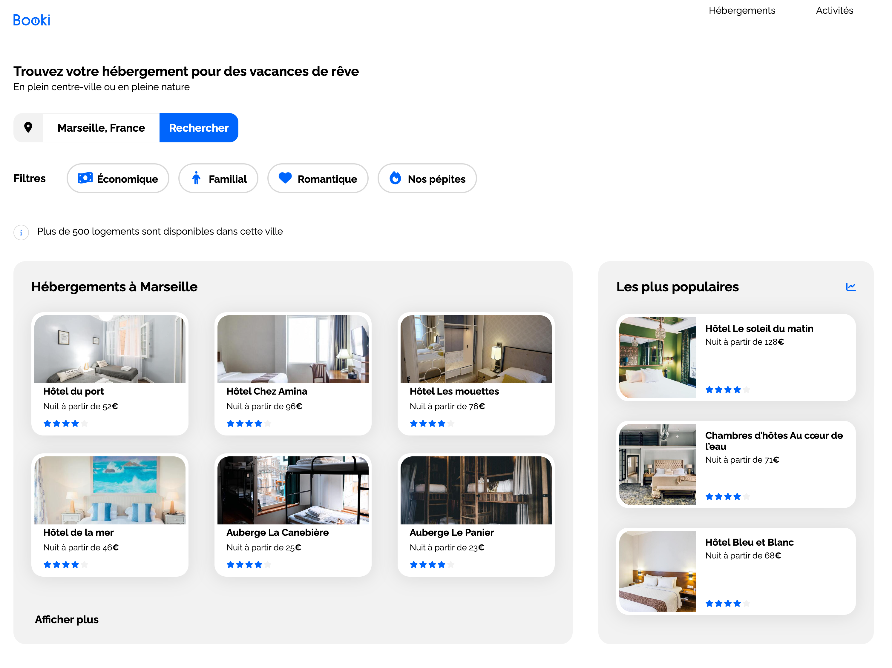

# 

Projet réalisé dans le cadre de la formation Développeur Web avec OpenClassrooms

## 🧐 Contexte (fictif)
L’entreprise Booki souhaite développer un site Internet qui permette aux usagers de trouver des hébergements et des activités dans la ville de leur choix.

Vous êtes chargé d'intégrer l'interface du site avec du code HTML et CSS. Pour cela, vous travaillez en étroite collaboration avec Sarah, la CTO, et Loïc, l’UI designer.

## 🚀 Objectifs
 - Intégrer le site en HTML et CSS avec la [maquette](https://www.figma.com/file/B3eLowtWREc9YXzBcGRAHn/Maquettes-Booki-(desktop)?node-id=3%3A0&t=e5nJosfI4jkfClMo-1) fournie et en respectant les spécifications de la [note de synthèse](https://course.oc-static.com/projects/D%C3%A9veloppeur+Web/DW_P2+HTML+CSS+Booki/DW+Booki+-+Note+de+synthese.pdf).
## 🛠️ Technologies

## 🏆 Résultat

➡️  [Visiter le site](https://halaiks.github.io/OC-P2-Booki)

## 🙋🏼‍♂️ Auteur

#### Alexandre GUILLAUME

- Site web : [Alexandre-Guillaume.fr](https://alexandre-guillaume.fr)
- Github : [@Halaiks](https://github.com/Halaiks)
